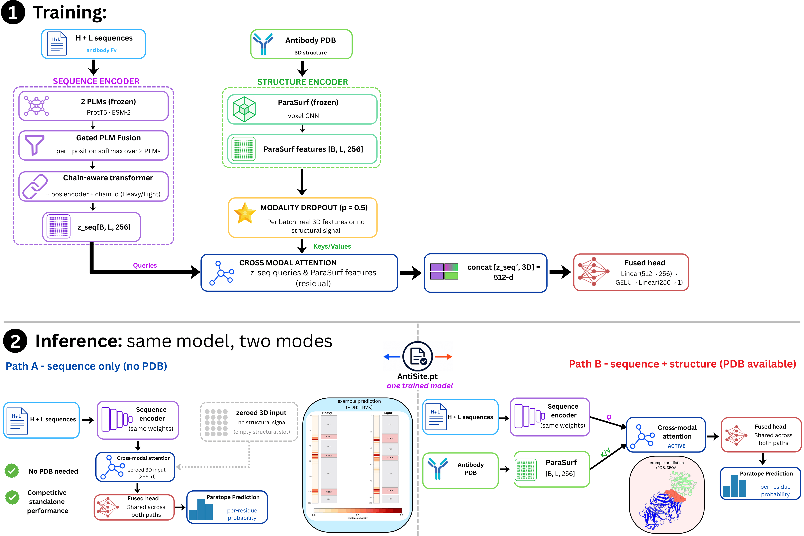
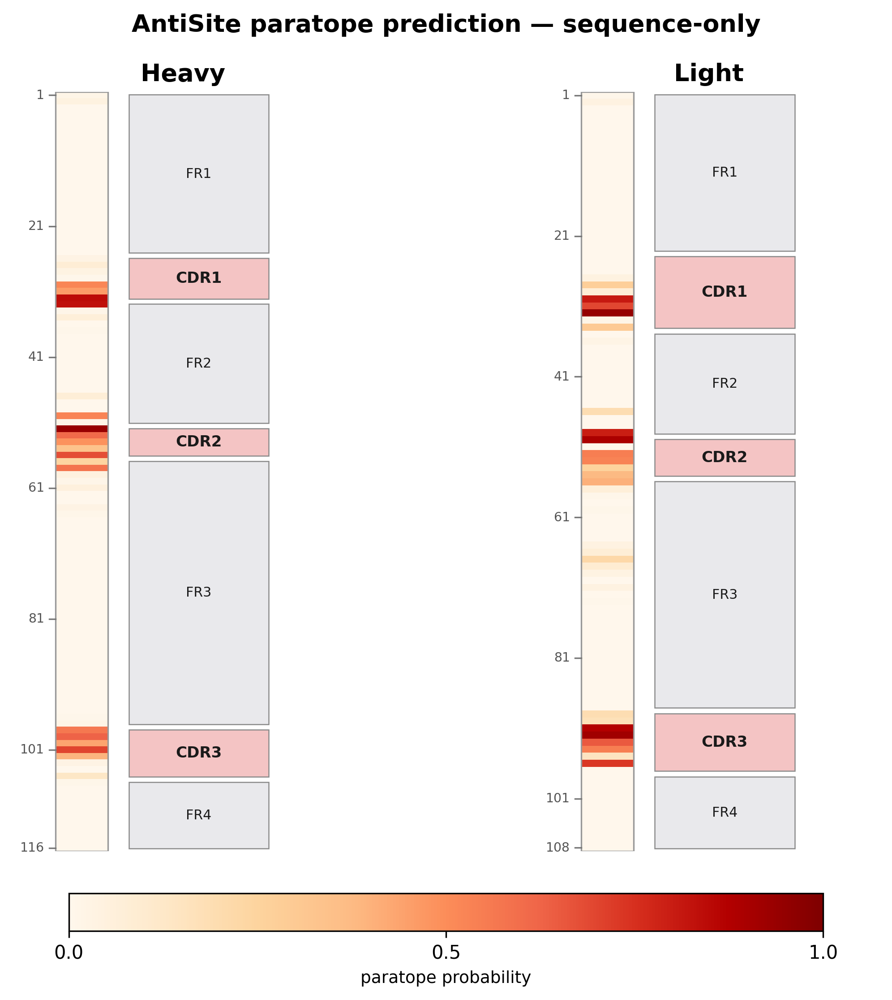
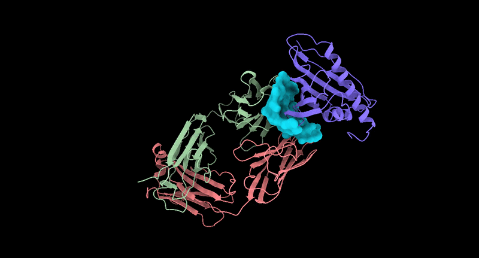

# AntiSite

## **Modality dropout for antibody paratope prediction, with or without structure, from a single model.**

[](LICENSE)
[](https://www.python.org/)
[](https://hub.docker.com/r/angepapa/antisite)
[](https://doi.org/10.5281/zenodo.21705412)

AntiSite predicts the antibody **paratope** (the residues that contact antigen) from a single trained
model. Its key design choice is **modality dropout**: the 3D features are withheld on half of the
training steps, so one checkpoint learns to predict both with and without a structure. It combines
frozen protein-language-model (PLM) embeddings with molecular-surface features
(from [ParaSurf](https://github.com/aggelos-michael-papadopoulos/ParaSurf)) through a cross-modal
attention layer, so that **one checkpoint serves two inference modes**:

| Mode | Input | When to use |
|---|---|---|
| **Sequence-only** | Heavy + light chain sequences | No structure available |
| **3D** | Sequences **+** a structure (ParaSurf features) | Structure available, best accuracy |



---

## ⚙️ Installation

AntiSite's headline model is structure-aware, so the full install below sets up **both** the sequence
and the 3D (ParaSurf) path. The same checkpoint can still run **sequence-only at inference** when you
have no structure; that is a runtime choice, not a lighter install.

### 🐳 Docker (recommended — zero setup, nothing to download)

A **fully self-contained** GPU image is the easiest way to run AntiSite. It bakes in the code, the
ParaSurf surface stack (DMS, OpenBabel, pdb2pqr) and **all** model weights — AntiSite checkpoints,
ParaSurf, ProtT5 and ESM-2 — so once you have the image there is **nothing left to download** and no
native dependencies to install. Requirements: an NVIDIA GPU with the
[NVIDIA Container Toolkit](https://docs.nvidia.com/datacenter/cloud-native/container-toolkit/latest/install-guide.html)
(so `--gpus all` works).

**Pull the pre-built image:**

```bash
docker pull angepapa/antisite:latest          # or: sudo docker pull angepapa/antisite:latest
```

👉 For how to **run predictions**, run the **offline smoke test**, and **build the image yourself**, see
**[docker/README.md](docker/README.md)**.

> Prefer a manual install, or no GPU-in-Docker? Use the from-source steps below.

---

### 📦 1. Core package (manual install from source)

```bash
git clone https://github.com/aggelos-michael-papadopoulos/AntiSite.git
cd AntiSite
conda create -n antisite python=3.10 -y
conda activate antisite
pip install -e ".[threed]"
```

This installs AntiSite and PyTorch, the **two protein language models** (**ProtT5** and **ESM-2**;
pretrained weights download automatically from HuggingFace on first use), and the
extra dependencies ParaSurf needs (`torchsummary`, `jsonpickle`).

### 🧬 2. ParaSurf (structure features)

The 3D path runs [ParaSurf](https://github.com/aggelos-michael-papadopoulos/ParaSurf) to extract
molecular-surface features from the antibody structure:

```bash
# 1) Clone ParaSurf into the repo root
git clone https://github.com/aggelos-michael-papadopoulos/ParaSurf.git

# 2) OpenBabel (chemical features): conda only
conda install -c conda-forge openbabel -y

# 3) DMS molecular-surface program (needs sudo); pdb2pqr ships inside ParaSurf
cd ParaSurf/dms && sudo make install && cd ../..

# 4) ParaSurf model weights — download FIRST (required for 3D mode).
#    Download the Paragraph-expanded ParaSurf model (link below) and save it as:
#        ParaSurf/Paragraph_expanded_entire_dataset_best.pth
```

Download the ParaSurf **Paragraph-expanded** weights here: [Paragraph_expanded_entire_dataset_best.pth](https://drive.google.com/uc?export=download&id=1nd3npYK303e8owDBvW8Ygd5m9SD1puhR)

> Do **not** run `pip install -r ParaSurf/requirements.txt` inside this environment; it pins an older
> `torch` and will break the AntiSite install. The steps above are all the 3D path needs.

At inference, point AntiSite at a ParaSurf weight file with `--parasurf-weights` (3D mode); omit the
structure to run sequence-only.

The headline released model is [`release/checkpoints/antisite_paragraph.pt`](release/checkpoints/antisite_paragraph.pt);
the same file runs both inference modes. Checkpoints trained on each benchmark are provided under
[`release/checkpoints/`](release/checkpoints/):

| Checkpoint | Trained on |
|---|---|
| `antisite_paragraph.pt` | Paragraph (headline model) |
| `antisite_pecan.pt` | PECAN |
| `antisite_aacdb.pt` | AACDB |
| `antisite_mipe_fold{0..4}.pt` | MIPE (5-fold) |

Every checkpoint uses the same 2-PLM (ProtT5 + ESM-2) architecture and runs both inference modes.

---

## 🔮 Inference

One command, **one `.pt` file**, two operating modes — the same checkpoint handles both.

### Sequence-only (no structure needed)

```bash
python antisite.py \
    --weights release/checkpoints/antisite_paragraph.pt \
    -vh DVKLVQSGPGLVAPSQSLSITCTVSGFSLTTYGVSWVRQPPGKGLEWLGVIWGDGNTTYHSALISRLSISKDNSRSQVFLKLNSLHTDDTATYYCAGNYYGMDYWGQGTSVTVSS \
    -vl DIAMTQTTSSLSASLGQKVTISCRASQDIGNYLNWYQQKPDGTVRLLIYYTSRLHSGVPSRFSGSGSGTDYSLTISNLESEDIATYFCQNGGTNPWTFGGGTKLEVKR
```

The PLMs encode the sequences and the fused head is fed **zero** 3D features (modality dropout taught
it to handle this).

<p align="center">
  
</p>
<p align="center"><em>Sequence-only residue-level paratope probabilities.</em></p>

### 3D (when you have a structure)

```bash
python antisite.py \
    --weights release/checkpoints/antisite_paragraph.pt \
    --antibody 1BVK_antibody.pdb \
    --parasurf-weights ParaSurf/Paragraph_expanded_entire_dataset_best.pth #frozen ParaSurf
```

<p align="center">
  
</p>
<p align="center"><em>Example 3D paratope prediction for PDB 1FSK; predicted residues are shown in cyan.</em></p>

---

## 📁 Data

Train / validation / test splits for all four benchmarks (Paragraph, PECAN, AACDB, MIPE) are provided
under **[`Data/`](Data/)** — each row gives the antibody heavy/light and antigen chain IDs **and their
sequences**. See [`Data/README.md`](Data/README.md) for the schema, split sizes, correction notes, and
checkpoint caveat.

The exact processed PDB inputs and corrected split metadata are archived on
[Zenodo](https://doi.org/10.5281/zenodo.21705412).

---

## 🏋️ Training

To reproduce AntiSite from scratch (data preparation, PLM embedding, ParaSurf feature precompute, and
single-dataset / 5-fold training), see **[TRAIN.md](TRAIN.md)**.

---

## 📄 License

Released under the [MIT License](LICENSE).

## 📖 Citation

```bibtex
Citation coming soon. The full manuscript citation will be added here after publication.

```
